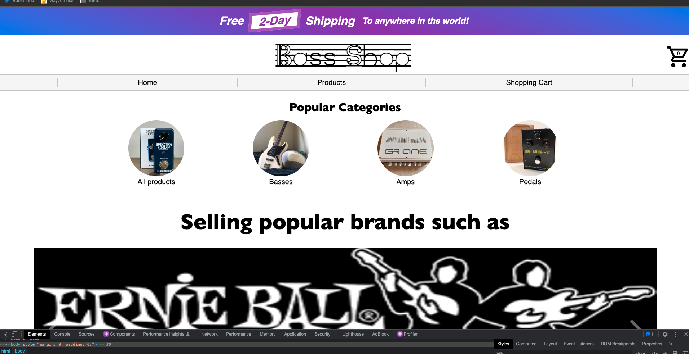
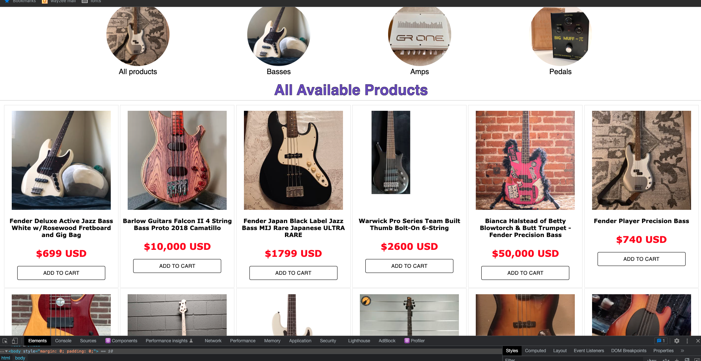
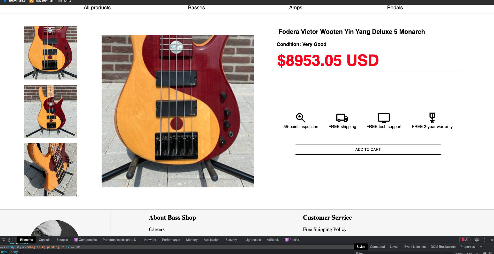
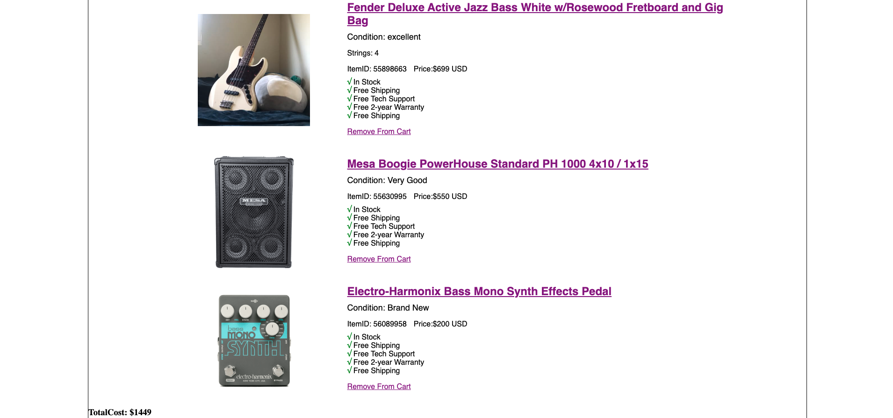

# Bass Shop

## Creator

- Blain Crawford

A template website for an online-shop selling bass guitar gear

## Deployed at:
https://bass-shop.netlify.app/

This project is a part of <a href="http://www.theodinproject.com">The Odin Project</a> curriculum.

## Technologies used
- <a href='https://www.javascript.com/'>JavaScript</a>
- <a href="https://www.w3schools.com/css/">CSS</a>
- <a href='https://reactjs.org/'>React</a>
- <a href="https://mui.com/">Material UI</a>
- <a href='https://webpack.js.org/'>webpack</a>
- <a href='https://code.visualstudio.com/'>Visual Studio Code</a>
- <a href='https://github.com/blain-crawford'>Git/Github</a>
- <a href='https://babeljs.io/'>babel</a>
- <a href='https://prettier.io/'>Prettier</a>
- <a href='https://eslint.org/'>ESLint</a>
- <a href="https://www.npmjs.com/package/react-router-dom">react-router-dom</a>
- <a href="https://jestjs.io/">Jest Testing</a>
- <a href="https://www.dafont.com/">Da Font fonts</a>
- <a href="https://reactjs.org/docs/hooks-reference.html">React Context</a>
- <a href="https://www.npmjs.com/package/react-responsive-carousel">React responsive Carousel</a>

## Application Functionality

- Load up application on Netlify or clone repository and user npm run server

- from then, just go through the site just like any other website!  

- the site has all the functionality of an online store, except for payment input and rendering as there are no actual products for sale.

- feel free to use a phone or chrome devtools to see scalability for mobile devices!

# Homepage

# Carousel
<video width="400px" alt="homePage" src='./src/readme-images/carousel.mov' controls></video>

# Product Page

# Individual Product Page

# Shopping Cart
